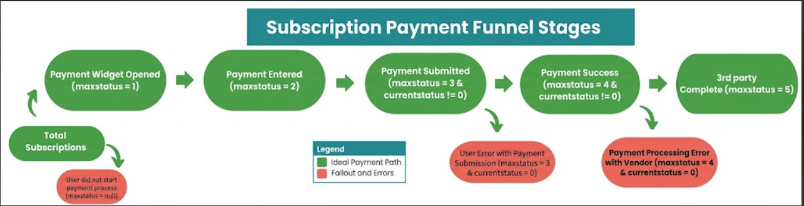

# 💳 Subscription Payment Funnel Analysis for SaaS . Product Analytics . FinTech

**Tools:** SQL · Snowflake · Hex (Data Science Notebook) · Python · Data Visualization  
**Skills:** CTEs · CASE Statements · Subqueries · Window Functions · LEFT JOIN / Anti-Join · Aggregate Functions · Data Wrangling · EDA  
**Domain:** SaaS · Product Analytics · FinTech  

🔗 [View the full Hex Notebook](https://app.hex.tech/big-sql-energy/hex/Payment-Funnel-Analysis-for-SaaS-Product-Analytics-FinTech-033NYsi8E2tJWC1aBJxsIi/draft/logic)

---

## 📋 Executive Summary

Across 59 total subscriptions, only 20.34% have successfully completed payment — meaning nearly 4 out of every 5 subscriptions are not converting. The single largest segment (41%) has never even opened the payment portal, representing an immediate revenue recovery opportunity that requires no product changes to address. An additional 16.95% of subscriptions encountered at least one payment error. This analysis identifies each drop-off point in the payment funnel, quantifies conversion and error rates, and delivers targeted recommendations for the product, engineering, and customer success teams.

---

## 🧩 Business Problem

The finance team escalated a growing revenue concern: a significant number of customers who had signed up for a paid subscription plan were not completing payment. Customers are considered active upon signup but are not counted as converted until payment is successfully processed — meaning the company was absorbing the cost of onboarding customers who were generating no revenue.

To investigate, I aligned with the product manager to map the end-to-end payment flow. The process works as follows: a customer opens the payment portal, enters their credit card details, and submits. That submission is routed to a third-party payment processor to handle the transaction. If the vendor confirms success, the payment is logged as complete on our side. Two distinct error points exist — one at the submission stage if the customer enters incorrect or incomplete information, and one at the vendor stage if the processor encounters an issue on their end.

Before any analysis could begin, I confirmed data availability with the frontend and data engineering teams. All major payment portal events are captured in the `payment_status_log`, providing a reliable event-level record to work from.

**Objectives:**
- Track each subscription's progress through the payment funnel, accounting for subscriptions that hit errors, cycle back to earlier statuses, or stall without completing the process
- Quantify how common errors are and determine whether the response should differ for user-side errors versus vendor-side errors
- Translate findings into actionable product recommendations that reduce friction and increase payment completion rate

---

## 🗂️ Data Model

The analysis was built on a SaaS subscription data model consisting of the following tables:

| Table | Type | Description |
|---|---|---|
| `Subscriptions` | Fact | Core subscription records including `current_payment_status`, revenue, and order date |
| `Payment_Status_Log` | Fact | Event-level log of every payment status movement per subscription |
| `Payment_Status_Definitions` | Dimension | Maps numeric status IDs (0–5) to descriptions |
| `Customers` | Dimension | Customer profile information |
| `Products` | Dimension | Product catalog data |
| `Cancelations` | Fact | Cancelation records with up to three reason codes |


---

## 🔀 Payment Funnel Architecture


```
Total Subscriptions (59)
│
├─► [Not Started] — No record in Payment_Status_Log (max_status IS NULL)
│
└─► Payment Widget Opened (max_status = 1)
       │
       └─► Payment Entered (max_status = 2)
              │
              └─► Payment Submitted (max_status = 3 & current_payment_status ≠ 0)
                     │
                     ├─► ⚠️ User Error with Payment Submission
                     │     (max_status = 3 & current_payment_status = 0)
                     │
                     └─► Payment Success w/ Vendor (max_status = 4 & current_payment_status ≠ 0)
                            │
                            ├─► ⚠️ Payment Processing Error with Vendor
                            │   (max_status = 4 & current_payment_status = 0)
                            │
                            └─► ✅ Complete (max_status = 5)
```

*Two distinct error fallout points exist: one at payment submission (user-side errors) and one post-payment success (vendor-side errors).*

---

## 🔧 Methodology

### 1. Exploratory Data Analysis (EDA)

Profiled the `Payment_Status_Log` and `Payment_Status_Definitions` tables joined together, ordering by `subscription_id` and `movement_date` to understand how individual subscriptions move through statuses over time. Spot-checked specific subscriptions to validate the data and understand edge cases — including subscriptions that cycle through statuses, hit errors, and retry.

For example, subscription `#38844` hit an error at status 0 after submitting payment, cycled back to re-enter payment, and ultimately completed the full workflow through status 5. Subscription `#38499` reached payment success (status 4) but then hit a vendor error and never reached completion — illustrating exactly why combining `max_status` with `current_payment_status` is necessary for accurate classification.

```sql
SELECT *
FROM public.payment_status_log psl
JOIN public.payment_status_definitions def ON psl.status_id = def.status_id
ORDER BY subscription_id, movement_date
```

### 2. Max Status Logic (CTE: `max_status_reached`)

Calculated the furthest point each subscription reached using `MAX(status_id)` from the `Payment_Status_Log`, grouped by `subscription_id`. Because the happy-path statuses (1–5) are in chronological order, `MAX` reliably identifies the furthest step reached — even when a subscription retried after an error.

```sql
WITH max_status_reached AS (
    SELECT
        psl.subscription_id,
        MAX(psl.status_id) AS max_status
    FROM public.payment_status_log psl
    GROUP BY 1
)
```

> **Key design decision:** A subscription can cycle backward through statuses after an error and retry. Using `MAX` ensures we credit each subscription with the furthest point they genuinely reached, not just where they currently sit. However, `max_status` alone is not enough — a subscription stuck at an error after reaching status 4 looks identical to one cleanly at status 4 without combining the current status.

### 3. Joining Max Status to Current Status

Left-joined `max_status_reached` onto the `Subscriptions` table to bring in `current_payment_status` alongside `max_status` for each subscription. A **LEFT JOIN** was critical — an inner join would have silently dropped all 24 subscriptions that never entered the payment portal, removing the most important segment from the analysis entirely.

### 4. Funnel Stage Classification (CTE: `payment_funnel_stages`)

Used a `CASE` statement combining `max_status` and `current_payment_status` to classify every subscription into a descriptive funnel stage. Added `DATE_TRUNC('year', order_date)` to enable year-level trend segmentation.

```sql
CASE
    WHEN max_status = 1 THEN 'Payment Widget Opened'
    WHEN max_status = 2 THEN 'Payment Entered'
    WHEN max_status = 3 AND current_payment_status = 0  THEN 'User Error with Payment Submission'
    WHEN max_status = 3 AND current_payment_status != 0 THEN 'Payment Submitted'
    WHEN max_status = 4 AND current_payment_status = 0  THEN 'Payment Processing Error with Vendor'
    WHEN max_status = 4 AND current_payment_status != 0 THEN 'Payment Success w/ Vendor'
    WHEN max_status = 5 THEN 'Complete'
    WHEN max_status IS NULL THEN 'User Has Not Started Payment Process'
END AS payment_funnel_stage
```

### 5. Conversion & Workflow Metrics

Created binary flag columns (`completed_payment` and `started_payment` = 1 or 0) and applied `SUM()` to calculate raw counts, then derived two core product metrics across the full dataset:

```sql
ROUND(num_subs_completed_payment * 100 / total_subs, 2)            AS conversion_rate,
ROUND(num_subs_completed_payment * 100 / num_subs_started_payment, 2) AS workflow_completion_rate
```

> Note: Year-level segmentation produced a division-by-zero error on some years due to the small sample dataset (no completions in 2019). The query was run across the full dataset to produce valid aggregate metrics.

### 6. Error Rate Analysis

Built an `error_subs` CTE using `DISTINCT subscription_id` where `status_id = 0` — using `DISTINCT` to avoid double-counting subscriptions that encountered multiple errors. Left-joined against the full `Subscriptions` table so the denominator represents all subscriptions, not just those in the payment log.

Both a **CTE approach** and a **subquery approach** were implemented and validated to produce identical results, demonstrating multiple SQL problem-solving strategies:

```sql
-- CTE approach
WITH error_subs AS (
    SELECT DISTINCT subscription_id
    FROM public.payment_status_log
    WHERE status_id = 0
)
SELECT ROUND(COUNT(err.subscription_id) * 100 / COUNT(subs.subscription_id), 2) AS perc_subs_hit_error
FROM public.subscriptions subs
LEFT JOIN error_subs err ON subs.subscription_id = err.subscription_id

-- Subquery approach (produces identical result)
SELECT
    (SELECT COUNT(DISTINCT subscription_id) FROM public.payment_status_log WHERE status_id = 0)
    * 100 / COUNT(*) AS perc_subs_hit_error
FROM subscriptions
```

### 7. Subscription-Level Error Flag

Created a binary `has_error` column (1 = hit at least one error, 0 = no error) at the subscription level by left-joining an `error_subs` CTE against the full `Subscriptions` table. Using `DISTINCT` in the CTE prevents double-counting subscriptions that hit errors multiple times. This produced a clean 59-row table that feeds directly into the error rate calculation and error visualizations.

```sql
WITH error_subs AS (
    SELECT DISTINCT subscription_id
    FROM public.payment_status_log
    WHERE status_id = 0
)
SELECT
    subs.subscription_id,
    CASE
        WHEN err.subscription_id IS NOT NULL THEN 1
        ELSE 0
    END AS has_error
FROM public.subscriptions subs
LEFT JOIN error_subs err ON subs.subscription_id = err.subscription_id
```

This confirmed that **10 out of 59 subscriptions** hit at least one error, with 49 subscriptions completing or progressing through the funnel without any errors.

### 8. Bonus: Window Function Approach for Current Status

As a bonus implementation, rebuilt the funnel stage classification using `ROW_NUMBER()` to derive the most recent payment status directly from the `Payment_Status_Log`, rather than relying on the pre-calculated `current_payment_status` column in `Subscriptions`. This approach is more robust for real-world scenarios where a convenient current-status field may not exist.

```sql
subs_current_status AS (
    SELECT
        subscription_id,
        status_id AS current_status,
        movement_date,
        ROW_NUMBER() OVER (PARTITION BY subscription_id ORDER BY movement_date DESC) AS most_recent_status
    FROM payment_status_log
    QUALIFY most_recent_status = 1
)
```

### 9. Data Visualization

Built the following charts in Hex, color-coded by funnel stage:

- **Bar chart** — Total subscriptions per funnel stage (overall snapshot)
- **Stacked bar chart** — Subscriptions by funnel stage segmented by order year
- **Line chart** — Subscriptions by funnel stage trend over time
- **Bar chart** — Count of subscriptions by error status (0 = no error, 1 = has error)
- **Pie chart** — Share of subscriptions with vs. without errors (built from a Python cell mapping binary flags to readable labels using pandas)

---

## 📊 Results


### Funnel Stage Distribution (All Years)

| Funnel Stage | # of Subscriptions | % of Total |
|---|---|---|
| 🔴 User Has Not Started Payment Process | 24 | 40.7% |
| ✅ Complete | 12 | 20.3% |
| 🟡 Payment Widget Opened | 7 | 11.9% |
| 🟠 Payment Success w/ Vendor | 5 | 8.5% |
| 🟠 Payment Submitted | 5 | 8.5% |
| 🟡 Payment Entered | 2 | 3.4% |
| 🔴 User Error with Payment Submission | 2 | 3.4% |
| 🔴 Payment Processing Error with Vendor | 2 | 3.4% |
| **Total** | **59** | **100%** |

### Funnel Stage by Order Year

| Order Year | Not Started | Complete | Other Stages |
|---|---|---|---|
| 2019 | 5 | 0 | 0 |
| 2022 | 10 | 6 | 13 |
| 2023 | 5 | 3 | 5 |
| 2024 | 4 | 3 | 5 |

### Key Metrics

| Metric | Value |
|---|---|
| Total Subscriptions | 59 |
| Subscriptions that Completed Payment | 12 |
| Subscriptions that Started Payment | 35 |
| **Payment Conversion Rate** | **20.34%** |
| **Workflow Completion Rate** | **34.29%** |
| **Error Rate** | **16.95%** |
| Subscriptions with at least one error | 10 |

### Key Findings

- **41% of subscriptions have never opened the payment portal.** This is the single largest segment and represents a top-of-funnel problem, not a checkout problem. Users are failing to engage before encountering any friction in the payment flow itself.
- **Among subscriptions that do start the payment workflow, 34.29% complete it** — compared to just 20.34% of all subscriptions. This gap confirms that activation (getting users to start) is the primary lever, not the checkout experience itself.
- **16.95% of subscriptions hit at least one error** during the payment process (10 out of 59). These fall across two distinct failure points: user-side submission errors and vendor-side processing errors after payment success.
- **No subscriptions from 2019 ever completed payment**, suggesting either a data issue or that the oldest cohort represents a period before the payment portal existed.

---

## 💡 Business Recommendations

**1. Activate non-starters with targeted outreach — highest priority**
24 subscriptions (41%) have never opened the payment portal. Implement automated payment reminder emails, in-app nudges triggered at key intervals after subscription creation, or proactive outreach from customer success reps. This requires no product changes and could directly convert a significant share of these 24 subscriptions.

**2. Reduce payment entry friction**
Add one-click payment options such as Apple Pay, Google Pay, or saved payment methods to reduce manual card entry. Requiring full credit card details every time increases both user input errors and abandonment — particularly on mobile. This directly addresses the 2 subscriptions stuck at user error with payment submission.

**3. Engage the third-party payment processing vendor**
Two subscriptions are stuck in a vendor-side processing error after payment success. Establish direct communication with the vendor to understand root causes, negotiate resolution SLAs, and track vendor error rates monthly. If the error rate does not improve, evaluate alternative processors.

**4. Improve error messaging at the payment submission stage**
Add inline form validation (e.g., card number length, expiry format) and clearer, action-oriented error messages so users understand exactly what went wrong and how to fix it, reducing the likelihood of abandonment after an error.

**5. Track all three metrics on a recurring basis**
Conversion rate (20.34%), workflow completion rate (34.29%), and error rate (16.95%) should serve as baseline KPIs monitored monthly or quarterly. As the dataset grows, segment by order year, product type, and customer cohort to identify whether trends are improving or worsening over time.

---

## 🔭 Next Steps

- **Error breakdown by type:** Determine whether user errors or vendor errors are more prevalent to prioritize where engineering resources should be directed first
- **Cohort analysis:** Segment conversion and error rates by order year with a larger dataset to identify whether the funnel is improving or degrading over time
- **Characteristics of non-starters:** Analyze whether the 24 subscriptions that never start payment share common attributes — product type, customer segment, acquisition channel — to inform targeted intervention strategies
- **Investigate the 2019 cohort:** Determine why none of the 5 subscriptions placed in 2019 ever completed payment
- **A/B testing framework:** Design experiments to measure the impact of payment reminders, one-click payment, and improved error messaging on conversion rate

---

## 🛠️ Skills Demonstrated

`SQL` · `CTEs` · `CASE Statements` · `Subqueries` · `Window Functions (ROW_NUMBER + QUALIFY)` · `LEFT JOIN` · `Anti-Join Pattern` · `MAX Aggregation` · `DISTINCT` · `DATE_TRUNC` · `Data Cleaning` · `Data Wrangling` · `Funnel Analysis` · `Product Metrics` · `EDA` · `Data Visualization` · `Python (pandas)` · `Snowflake` · `Hex Notebook` · `Stakeholder Communication`

---
